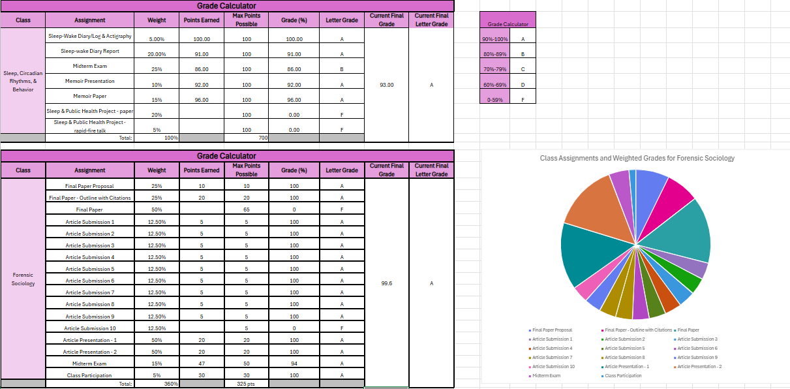
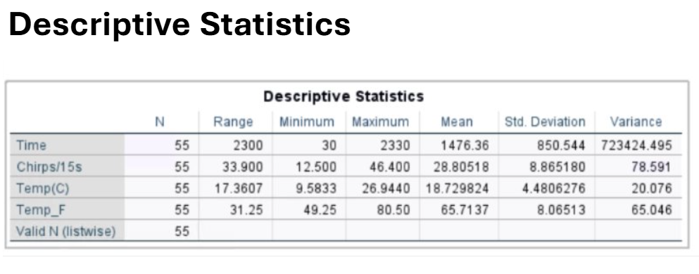

# Corrine Bertoglio's portfolio

### About Me
Hello! I am a senior who is gathering skills in Psychology, Forensic Studies, Criminology, and Computer Science. 

With minor skills in programming, calculating, and statistical analysis, I am able to effectively analyze data, and to use these skills to conduct research in the future. I am adept at using Microsoft Excel, JDoodle, and IBM SPSS Statistics. 

My expanding skill set, commitment to quality analyses, and passion for research makes me a valuable asset.  In my spare time, I am focusing on researching internships for after I graduate and preparing for data collection for my individual research experience in Spring 2025. 

You can find me on [LinkedIn](https://www.linkedin.com/in/corrine-bertoglio-786949362/).

### Education
BA in Psychology  
Loyola University Maryland

### Projects

#### Personality Test
The personality test was one way that we enhanced out skills using python coding in JDoodle. 

- 
- Link to complete the test in JDoodle: https://www.jdoodle.com/ga/MXN9i0BFteLm4L0u%2FwIorQ%3D%3D 

>The purpose of the personality test was to introduce the concept of loops. We used while loops as error checking to ensure that the participants could only input A, B, C, or D as their answers. We also learned how to use if/elif; in this case, we used it for scoring and for a total personality score. 
>
>I did not face many challenges during the setup of the personality test. However, one issue I constantly faced was the aesthetic of the output. I struggled with where to put a new line or indent, and I found myself having to stop execution many times to fix little mistakes like this. 
>
>With the goal of creating a personality test that does what it is intended to do, I would say I achieved my goal. I think further imrovements would be to clean up the code, if there is a way to do so. For example, having to copy and paste the error checking 10 times was a bit of a pain. 

#### Grade Calculator
The Grade Calculator was very handy when it came to organizing my grades for my hardest classes. 

- 

>The putpose of the grade calculator was to have all of the assignments for each course in one place. Another purpose was to be able to have a running calculation of my grade throughout the semester. One feature I like is that I can see how a grade on one assignement will affect my overall grade in the course. 
>
>The grade calculator was challenging for me. The most difficult part was the formula for the total percentage of all assignments in the class. I kept getting outrageously high numbers and it took me a while to figure out how to make it make sense. 
>
>The grade calculator is very handy to stay on top of assignments I have already completed, versus ones that I still need to keep in mind. I have tried to make an effort to keep up with updating the calculator as my teachers grade work so that I know what my current grade is. I am also planning to elaborate on this project by building a grade calculator for my courses in the spring semester. 

#### SPSS Statistical Analysis
I used SPSS to analyze data that was given to me, as well as data from research I had conducted myself in the spring 2025 semester. 

- 
- 
- 

>Working with SPSS was the main reason I wanted to take this class. As a psychology major, I dabbled with SPSS in Spring of 2025 when I took research methods 2 and completed a research study with real data. I was hoping that this course would either help to solidify those skills or to establish new ones that I can use in my individual research study. 
>
>I did not face many challenges with SPSS, as I had already had some experience with using the application. I think that it was very helpfulto have a refresher to SPSS before I start collecting and analyzing data for my research study in the Spring of 2026. I did, however, learn new ways to create graphs than what was taught to me in research methods. 
>
>I am happy that I was able to tuch up on my skills that I carried over from last semester. I feel more confident for when I gather data next semester that I can effectively create meaningful graphs and tables that showcase the data I collect. 
